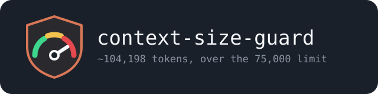

<p align="center">
  
</p>

# claude-context-size-guard

[](https://github.com/hacknitive/claude-context-size-guard/actions/workflows/test.yml)
[](LICENSE)

Stops you from sending a prompt into an already-bloated context.

A hook for [Claude Code](https://claude.com/claude-code). It measures the live context on every prompt and, once it passes a threshold (default **150,000 tokens**), tells you to run `/compact` — instead of letting you burn a full expensive turn on a context that should have been compacted three prompts ago.

Five [modes](#modes) decide *when* it speaks (before your prompt, or after the answer) and *what it costs* (nothing, or one model turn).

```
Context guard: ~187,402 tokens, over the 150,000 limit. Run /compact, then resend.
Bypass once by prefixing the prompt with !!
```

Installs **once per user account**, so it applies to every project and every session on the machine — not per repo.

---

## Why

A long session degrades quietly. Nothing warns you; the model just gets slower, more expensive, and worse at holding the thread. By the time you notice, you have already paid for several full-context turns. This guard makes the threshold explicit and puts the decision in front of you *before* the turn is billed.

| | Without the guard | With the guard |
|---|---|---|
| Crossing the limit | Nothing happens. You find out from the bill or the latency. | One-line notice on the next prompt. |
| Cost of the turn that trips it | Full context, full price. | One short notice. |
| Deciding when to `/compact` | Guesswork. | A number you configured. |

---

## Install

### Claude Code plugin (recommended)

```bash
/plugin marketplace add hacknitive/claude-context-size-guard
/plugin install claude-context-size-guard@claude-context-size-guard
```

Restart Claude Code. Active on the next session.

### Standalone (no plugin loader)

```bash
git clone https://github.com/hacknitive/claude-context-size-guard
cd claude-context-size-guard
./install.sh                    # installs into $CLAUDE_CONFIG_DIR (or ~/.claude)
./install.sh --all-accounts     # installs into every ~/.claude-* config dir
./install.sh --limit 200000     # install and set the threshold in one go
./install.sh --mode notice      # install and set the mode in one go
./install.sh --dry-run          # preview only
./install.sh --uninstall        # remove hook + settings entry
```

Windows:

```powershell
.\install.ps1
```

Requires Node.js 18+. No third-party packages.

The installer merges into your **existing** `settings.json`: it keeps every hook you already have, tolerates `//` comments in the file, writes a numbered `.bak` next to it, and is idempotent — run it twice and you still get exactly one guard entry per event. If it cannot parse your `settings.json` it refuses and changes nothing.

Takes effect on your next prompt. No restart needed for the standalone install (Claude Code re-reads hook config per prompt); the plugin install needs one restart.

### Verify

```bash
node test/selftest.js               # test the repo copy
node test/selftest.js --installed   # test the copy in $CLAUDE_CONFIG_DIR
```

Expect `25/25 passed`.

---

## Using it

| Situation | What to do |
|---|---|
| Guard fires | Run `/compact`, then resend your prompt. |
| The guard eats your turns instead of answering | You are on `mode: "warn"`. The default `"notice"` prints the same line and still answers. |
| You need this one prompt through anyway | Prefix it with `!!` — e.g. `!! just answer quickly`. |
| Guard fires right after a `/compact` | Send one `!!` prompt. The measurement lags by one turn (see *How it measures*), so the first post-compact prompt can still read the pre-compact size. |

---

## Configuration

Priority, highest first:

1. Environment: `CONTEXT_GUARD_LIMIT`, `CONTEXT_GUARD_MODE`, `CONTEXT_GUARD_BYPASS`, `CONTEXT_GUARD_MIN_RECORDS`
2. Repo-local, walking up from `cwd`: `./.context-guard.json` or `./.context-guard/config.json`
3. User config: `~/.config/claude-context-size-guard/config.json` (Linux/macOS) / `%APPDATA%\claude-context-size-guard\config.json` (Windows)
4. Built-in defaults

Config file shape — every key optional:

```json
{
  "mode": "notice",
  "limit": 150000,
  "bypass": "!!",
  "minRecords": 5
}
```

| Key | Default | Meaning |
|---|---|---|
| `mode` | `"notice"` | When and how the guard speaks. Five values — see *Modes* below. |
| `limit` | `150000` | Estimated tokens of live context before the guard fires. |
| `bypass` | `"!!"` | Prompt prefix that skips the guard for that one prompt. |
| `minRecords` | `5` | Below this many records since the last compact, never fire. |

A malformed config file is ignored rather than crashing the hook — a crashing `UserPromptSubmit` hook puts a red banner on every prompt, which is worse than falling back to defaults.

**Tuning `limit`.** Read the default against your context window, because 150,000 means very different things on either side of it:

| Window | 150,000 is | Verdict |
|---|---|---|
| 1M | 15% full | early, with plenty of room for `/compact` to work |
| 200k | 75% full | late — `/compact` has little left to summarise |

On a 200k window, set `limit` to 100,000 or lower. A repo-local `.context-guard.json` lets one heavy monorepo run a different threshold from the rest of your work.

---

## Modes

The guard is wired on two events — `UserPromptSubmit` and `Stop` — and `mode` decides which one speaks. Switching modes is a config edit; you never reinstall.

| `mode` | Fires | Prompt answered | Costs a turn | What you see |
|---|---|---|---|---|
| `off` | never | yes | no | nothing |
| `warn` | before the prompt | **no** | **yes** | a notice line, then Claude repeating it instead of answering |
| `notice` **(default)** | before the prompt | yes | no | a notice line, then your answer |
| `after` | after the answer | yes | no | your answer, then a notice line under it |
| `after-nudge` | after the answer | yes | **yes** | your answer, then Claude speaking the notice |

Two questions, crossed: warn *before* you spend the turn or *after*, and pay a model turn to say so or not.

```
                  free (Claude Code prints it)   costs a turn (Claude says it)
before the prompt  notice                         warn
after the answer   after                          after-nudge
```

**`warn`** was the default before 2.0.0 and is the most forceful: your prompt is not answered at all, so you cannot ignore it. It is also the only mode that spends a full model turn telling you a turn is expensive, and the notice appears twice — once from Claude Code, once from Claude.

**`notice`** is the default, and is `warn` minus the self-defeating half. Same line, same place, but your prompt still runs and no model turn is spent. Easy to ignore, which is the trade — if you want the guard to actually stop you, use `warn`.

**`after`** is the only mode with **no measurement lag.** `Stop` runs after the turn it measures, so the number is current. Every `UserPromptSubmit` mode reads the *previous* turn's accounting and is one turn stale — which is why a pre-`Stop` guard can fire spuriously right after a `/compact`. The cost is that the warning lands after the expensive turn rather than before it.

**`after-nudge`** puts the notice in the conversation rather than in a system line, so it is harder to scroll past — for the price of an extra turn. It respects `stop_hook_active`; without that flag, `additionalContext` on `Stop` resumes the conversation, which ends, which fires `Stop` again, and the session loops indefinitely.

Set it per install, per repo, or per shell:

```bash
./install.sh --mode notice          # writes it to your user config
CONTEXT_GUARD_MODE=after claude     # one session
echo '{"mode":"after"}' > .context-guard.json   # one repo
```

---

## How it measures

Two sources, in order:

1. **Measured.** The last assistant record in the transcript carries the API's own accounting in `message.usage`. Real prompt size is `input_tokens + cache_read_input_tokens + cache_creation_input_tokens`. This is exact, and lags reality by at most one turn.
2. **Fallback** (no assistant turn since the last compact boundary): `chars / 4` over whole transcript records, excluding bookkeeping types that never reach the model — `file-history-snapshot`, `file-history-delta`, `queue-operation`, `last-prompt`, `ai-title`, `pr-link`.

Both count only records written **since the last compact boundary** (`isCompactSummary` or `subtype == "compact_boundary"`), so a `/compact` resets the number.

The fallback deliberately measures the whole record, not just `record.message`. Counting only `message` silently drops `attachment` and `system` records, which on a real transcript are the largest single bucket — that bug made an earlier version of this guard under-report by roughly 2.5×.

The `minRecords` floor prevents a deadlock: immediately after a compact there is nothing left to compact, so firing there would trap the session with no way forward but the bypass prefix.

---

## What ships

```
claude-context-size-guard/
├── src/hooks/
│   ├── context-size-guard.js    # the hook — UserPromptSubmit
│   └── guard-config.js          # config resolution (env → repo → user → defaults)
├── bin/
│   ├── install.js               # standalone installer (merges settings.json)
│   └── lib/settings.js          # JSONC-tolerant reader/writer
├── test/selftest.js             # 25-case verification
├── .claude-plugin/
│   ├── plugin.json              # Claude Code plugin manifest
│   └── marketplace.json         # single-plugin marketplace, for /plugin marketplace add
├── install.sh / install.ps1     # thin shims to bin/install.js
├── package.json / LICENSE / README.md / CLAUDE.md
```

---

## Known limits

- **Measurement lags by one turn in the `UserPromptSubmit` modes.** `message.usage` describes the turn that just finished, not the prompt you are about to send. Practical effect: `warn` and `notice` can fire once immediately after a `/compact`; one `!!` prompt clears it. `after` and `after-nudge` run after the turn they measure and do not have this problem.
- **The fallback is an estimate.** `chars / 4` is a rough English-text heuristic; code and non-Latin scripts tokenize differently. It only applies when no assistant turn has happened since the last compact.
- **Wired at two layers, it fires twice.** Claude Code merges hook layers (user, project, local) without deduplicating by script path. If you install both as a plugin and standalone, remove one.
- **Claude Code only.** Nothing here is portable to other agent runtimes.

---

## Troubleshooting

**Guard never fires.** Check the wiring landed:

```bash
node -e "console.log(JSON.stringify(require(require('os').homedir()+'/.claude/settings.json').hooks.UserPromptSubmit,null,2))"
```

The command in there must point at a file that exists.

**Guard fires twice per prompt.** Wired at two layers. Remove one — `./install.sh --uninstall` removes the standalone wiring and leaves a plugin install alone.

**`settings.json` cannot be parsed.** The installer refuses to touch a broken settings file and changes nothing. Fix the JSON by hand, then re-run.

**`node: command not found`.** Install Node.js 18+ from [nodejs.org](https://nodejs.org). The hook runs under whatever `node` is on `PATH` when Claude Code starts.

---

## Compatibility

Composable with other always-on hooks and modes — [ai-real-friend](https://github.com/hacknitive/ai-real-friend), caveman, and anything else on `UserPromptSubmit` or `Stop`. This guard adds one entry per event and strips only its own on uninstall.

---

## License

MIT. See `LICENSE`.
